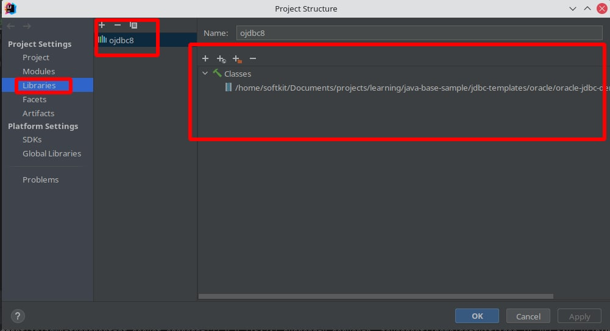

# Oracle Data Base demo
Describe how to work with odbc as external lib 

How to set odbc jar to class path



## Oracle database 

The compose folder in this project root contains the docker-compose file to start  **oracle XE 11** in a docker 
### to run docker compose 

move to docker-compose folder 
start docker compose 

```bash
 docker-compose -f docker-compose.yml up -d
```

To check run docker-compose's 
```bash
  docker-compose ps
```

to stop 
```bash
  docker-compose stop oracle01
```