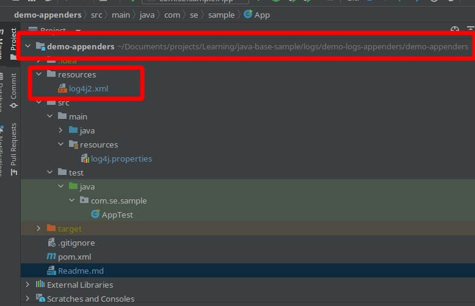

## Запуск 
аппендеры расположены


current path 
```bash
/home/softkit/Documents/projects/Learning/java-base-sample/logs/demo-logs-appenders/demo-appenders/resources
```
Как указать расположение конфигурации при запуске 

комманда 
```
-Dlog4j2.configurationFile=file:/log4j2.xml
```

in this case 
```properties
-Dlog4j.configurationFile=/home/softkit/Documents/projects/Learning/java-base-sample/logs/demo-logs-appenders/demo-appenders/resources/log4j2-local.xml
```


запусе в консоли
```
    java -jar log-demo.jar
```
ERROR StatusLogger No log4j2 configuration file found. Using default configuration: logging only errors to the console.

фиксим указав расположение файла для логгера 
```bash
  java -jar -Dlog4j.configurationFile=/home/softkit/Documents/projects/Learning/java-base-sample/logs/demo-logs-appenders/demo-appenders/resources/log4j2-local.xml log-demo.jar 
```


## Расположение по умолчанию 
src/main/resources‘ folder -> log4j2.xml

Указат ьпри запуске 
using the application startup parameter or system property log4j.configurationFile.


### base 
```xml
<dependency>
    <groupId>org.apache.logging.log4j</groupId>
    <artifactId>log4j-core</artifactId>
    <version>2.14.1</version> <!-- update this! -->
</dependency>
```
to check
```bash
    mvn dependency:tree -Dincludes=org.apache.logging.log4j:log4j-core
```
ya-yay
````xml
[INFO] --- maven-dependency-plugin:2.8:tree (default-cli) @ demo-logs-appenders ---
[INFO] com.se.sample:demo-logs-appenders:jar:1.0-SNAPSHOT
[INFO] \- org.apache.logging.log4j:log4j-core:jar:2.14.1:compile
````

to make effective pom
```xml
   mvn help:effective-pom | grep log
```

log4j состоит из трех основных компонентов:
  * Регистраторы : Ответственный за сбор информации журнала.
  * appenders : Отвечает за публикацию информации о регистрации в различных предпочтительных местах назначения.
  * макеты : отвечает за форматирование информации журнала в разных стилях.

step1. Base appenders 
```properties
 ### Настройки ###
log4j.rootLogger = debug,stdout,D,E

### Вывод информации на контрольный лифт ###
log4j.appender.stdout = org.apache.log4j.ConsoleAppender
log4j.appender.stdout.Target = System.out
log4j.appender.stdout.layout = org.apache.log4j.PatternLayout
log4j.appender.stdout.layout.ConversionPattern = [%-5p] %d{yyyy-MM-dd HH:mm:ss,SSS} method:%l%n%m%n

### Вывести журналы выше уровня DEBUG в = E://logs/error.log ###
log4j.appender.D = org.apache.log4j.DailyRollingFileAppender
log4j.appender.D.File = /imn/logs/log.log
log4j.appender.D.Append = true
log4j.appender.D.Threshold = DEBUG
log4j.appender.D.layout = org.apache.log4j.PatternLayout
log4j.appender.D.layout.ConversionPattern = %-d{yyyy-MM-dd HH:mm:ss}  [ %t:%r ] - [ %p ]  %m%n

### Вывести журналы выше уровня ERROR в = E://logs/error.log ###
log4j.appender.E = org.apache.log4j.DailyRollingFileAppender
log4j.appender.E.File =/imn/logs/error.log
log4j.appender.E.Append = true
log4j.appender.E.Threshold = ERROR
log4j.appender.E.layout = org.apache.log4j.PatternLayout
log4j.appender.E.layout.ConversionPattern = %-d{yyyy-MM-dd HH:mm:ss}  [ %t:%r ] - [ %p ]  %m%n
```

Result in file 
```path
/imn/logs/log.log
```
```txt
2022-07-21 19:15:33  [ main:0 ] - [ DEBUG ]  This is debug message.
2022-07-21 19:15:33  [ main:1 ] - [ INFO ]  This is info message.
2022-07-21 19:15:33  [ main:2 ] - [ ERROR ]  This is error message.

```
тип логирования - консоль
log4j.appender.stdout = org.apache.log4j.ConsoleAppender 


```
    https://javastudy.ru/log4j/log4j-hello-world-example/
```

- рутовый логгер - для всех 
- логгер для конкретного класса.

атрибут level=’debug’ и атрибут additivity=’true’.
* level — задает уровень на котором будет происходить логирование (например при дебаге, при ошибках или всегда).
* additivity — поможет убрать дубляж в логах. 

нужен api и log4j-core
```
ERROR StatusLogger Log4j2 could not find a logging implementation. Please add log4j-core to the classpath. Using SimpleLogger to log to the console...
```

Automatic Configuration


старый формат
```properties
<!DOCTYPE log4j:configuration SYSTEM "log4j.dtd">
<log4j:configuration>
    <appender name="MAIN" class="org.apache.log4j.ConsoleAppender">
        <param name="Target" value="System.out"/>
        <layout class="org.apache.log4j.PatternLayout">
            <param name="ConversionPattern" value="%r [%t] %-5p %c %x - %m%n" 
/>
        </layout>
    </appender>
    <root>
        <priority value ="debug"></priority>
        <appender-ref ref="MAIN" />
    </root>
</log4j:configuration>
```

base appenders

* ConsoleAppender – the appender that appends the log events to System.out or System.err with the default being System.out. When using this appender you will see your logs in the console of your application.
* FileAppender – the appender that appends the log events to a defined file storing them on the file system.
* RollingFileAppender – the appender that extends the FileAppender and rotates the file when it reaches a defined size. The use of RollingFileAppender prevents the log files from becoming very big and hard to maintain.
* SyslogAppender – the appender sending the log events to a remote Syslog daemon.
* JDBCAppender – the appender that stores the log events to the database. Keep in mind that this appender will not store errors and it is generally not the best idea to store the log events in a database.
* SocketAppender – the appender that sends the serialized log events to a remote socket. Keep in mind that this appender doesn’t use layouts because it sends the serialized, raw log events.
* NullAppender – the appender that just discards the log events.
 

... Logger LOGGER = LoggerFactory.getLogger(MyAwesomeClass.class);